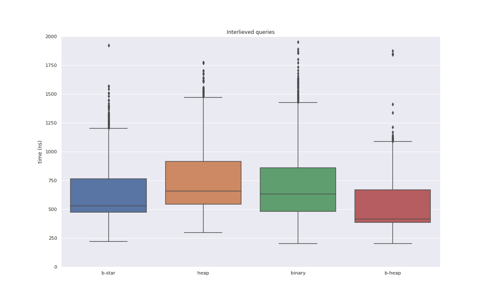
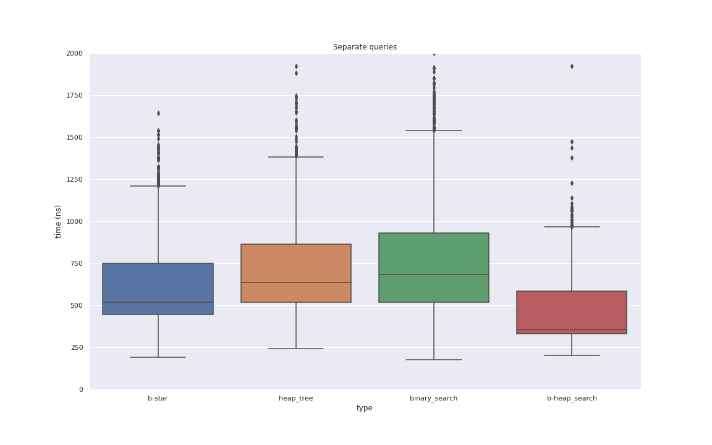

# Binary search patterns

Testing a few binary search-based implementation on static sorted  data.

### binary search

Straight up classical binary search, with the implied inefficient memory access pattern.

Is generally faster than expected.

### B-star tree

A B-tree is built based on the data. Branch selection in internal nodes is done with a templated power-of-2 -based binary search.

Is pretty ok but very space inefficient and loses comparative perofmance as the data structure size grows.

### Heap ordered binary search

Input data is "reordered" in such a way that the middle element is first, then the middle of the left and right sides, followed by the middles of the left and right portions of the left side and so on. For each "node" at index `i`, the left child is at `i * 2 + 1` and the right child is a t `i * 2 + 2`

Uses up to double the space of the raw data due to the data not necessarily conforming to the linearized tree topology.

Is typically faster than the B-star tree.

### B-heap tree

Combination of B-star tree and Heap ordered binary search. The B-tree nodes are stored in heap order. No child offsets or pointers are stored since children of a node at index `i` will be between indexes `i*B + 1` and `i*B + B`.

Seems to be very space efficient and fast in practice.

## Usage

Compile with `make binary_search_patterns`.

Generate test data with 

```bash
python gen_data.py n m > file
```

where `n` is the size of the data structure, `m` the number of queries to generate and `file` an output file.

Run with

```bash
./binary_search_patterns type < file >> /dev/null
```

where `file` is a file generated by `gen_data.py` and `type` is

* 0 (or ommitted) to run queries interlieved on all the data structures at the same time,
* 1 to force cache invalidation between every query (**Caution: Very slow!)**,
* 2 to test each data structure separately.

Pipe data to ´/dev/null´ to avoid creating large tsv files with query data. If you want the per-query data, pipe somewhere else.

## Results

### AMD EPYC 7452, 10 million elements

|             | b-star    |heap       | binary    | b-heap    |
|-------------|-----------|-----------|-----------|-----------|
| interlieved | 435.315ns | 452.6ns   | 701.07ns  | 343.715ns |
| separate    | 363.409ns | 331.548ns | 524.348ns | 313ns     |
| space       | 157.511MB | 128MB     | 76.294MB  | 78.3257MB |


### Intel(R) Xeon(R) CPU E7-8890 v4, 10 million elements

|             | b-star    |heap       | binary    | b-heap    |
|-------------|-----------|-----------|-----------|-----------|
| interlieved | 366.863ns | 417.233ns | 505.9ns   | 279.846ns |
| separate    | 303.785ns | 345.14ns  | 422.613ns | 241.694ns |
| space       | 157.511MB | 128MB     | 76.294MB  | 78.3257MB |





### Intel(R) Core(TM) i5-6200U

#### 10 million elements

|             | b-star    |heap       | binary    | b-heap    |
|-------------|-----------|-----------|-----------|-----------|
| interlieved | 561.28ns  | 498.914ns | 716.946ns | 441.875ns |
| separate    | 466.803ns | 486.74ns  | 597.929ns | 342.764ns |
| space       | 157.511MB | 128MB     | 76.294MB  | 78.3257MB |


#### 2<sup>22</sup> elements

|             | b-star    |heap       | binary    | b-heap    |
|-------------|-----------|-----------|-----------|-----------|
| interlieved | 457ns     | 437.386ns | 740.246ns | 413.903ns |
| separate    | 403.261ns | 361.765ns | 669.613ns | 280.641ns |
| space       | 66.065MB  | 64MB      | 32MB      | 34.0318MB |

#### 2<sup>20</sup> elements

|             | b-star    |heap       | binary    | b-heap    |
|-------------|-----------|-----------|-----------|-----------|
| interlieved | 365.352ns | 365.489ns | 553.281ns | 316.461ns |
| separate    | 290.329ns | 300.275ns | 516.241ns | 241.682ns |
| space       | 16.5161MB | 16MB      | 8.00002MB | 10.0318MB |

#### 100k elements

|             | b-star    |heap       | binary    | b-heap    |
|-------------|-----------|-----------|-----------|-----------|
| interlieved | 238.594ns | 261.364ns | 239.122ns | 203.512ns |
| separate    | 169.136ns | 201.664ns | 204.993ns | 124.091ns |
| space       | 1.57619MB | 2MB       | 0.762955MB| 0.794945MB|


